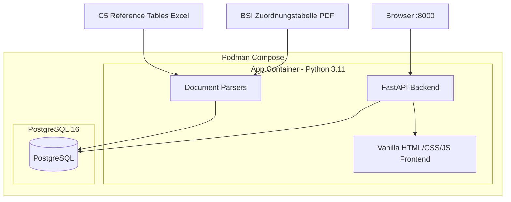

# Compliance Framework Mapping Tool

Map controls between **ISO 27001:2022**, **BSI IT-Grundschutz**, and **C5:2020** using official mapping documents. Built for IBM as a lookup-table tool that clusters multiple requirement sources to ease compliance implementation.

## Architecture



## Features

| Feature | Description |
|---------|-------------|
| **Control Lookup** | Search any control ID or keyword, view bidirectional mappings across all frameworks. Click a mapped control to drill into its own mappings. |
| **Coverage Analysis** | Compare two frameworks: coverage percentage, gap list, unmapped controls, full mapping table. |
| **Version Tracking** | Track changes between framework versions (added, modified, renamed, removed controls). |
| **Document Upload** | Upload new mapping documents (PDF, Excel, CSV) with explicit source/target framework and year selection. |
| **BSI-Standard Refs** | Parses both IT-Grundschutz requirement IDs (e.g. `ISMS.1.A3`) and BSI-Standard document references (e.g. `BSI-Standard 200-2, Kapitel 9`). |
| **API Docs** | Auto-generated Swagger UI at `/docs`. |

## Data Sources

| Document | Format | Content |
|----------|--------|---------|
| BSI Zuordnungstabelle (Edition 6, 2022) | PDF | ISO 27001:2022 clauses + Annex A mapped to BSI IT-Grundschutz modules and BSI-Standards |
| C5:2020 Reference Tables | Excel | 121 C5 criteria mapped to ISO 27001:2022 clauses and Annex A controls |

## Seeded Data

- **3 Frameworks**: ISO 27001:2022 (105 controls), BSI IT-Grundschutz Edition 6 (407 controls), C5:2020 (121 controls)
- **666 Official Mappings** from the two source documents
- ISO 27001 clause titles (4.1-10.2) with real names

## Tech Stack

| Layer | Technology |
|-------|-----------|
| Backend | FastAPI, SQLAlchemy (async), Pydantic |
| Database | PostgreSQL 16 (pgvector-ready for future AI module) |
| Frontend | Vanilla HTML/CSS/JS, IBM Plex Sans/Mono |
| Containerization | Podman + podman-compose |
| PDF Parsing | pdfplumber |
| Excel Parsing | pandas + openpyxl |
| Migrations | Alembic (configured) |

## Database Schema

```sql
frameworks   (id, name, short_name, version, description, is_active)
controls     (id, framework_id, control_id, title, description, category, UNIQUE(framework_id, control_id))
mappings     (id, source_control_id, target_control_id, confidence, source_type, source_document, notes)
version_changes (id, framework_id, old_version, new_version, change_type, old_control_id, new_control_id, description)
```

## Project Structure

```
├── app.py                  # FastAPI application (routes, schemas)
├── database.py             # SQLAlchemy models, async/sync engines
├── document_parser.py      # BSI PDF + C5 Excel + CSV parsers
├── seed_data.py            # CLI to seed frameworks, controls, mappings
├── test_mappings.py        # Automated mapping validation (25 checks)
├── podman-compose.yml      # PostgreSQL 16 + app containers
├── Dockerfile              # Python 3.11-slim, uvicorn
├── requirements.txt        # Python dependencies
├── static/
│   ├── index.html          # Single-page app shell
│   ├── style.css           # IBM Carbon-inspired design
│   └── app.js              # Client-side logic
└── data/                   # Mount point for source documents (not committed)
    ├── Zuordnung_ISO_und_IT_Grundschutz_Edit_6.pdf
    └── C5_2020_Reference_Tables_ISO27001.xlsx
```

## Quick Start

### Prerequisites

- [Podman](https://podman.io/) with podman-compose
- BSI PDF and C5 Excel in the `data/` folder

### Start

```bash
podman machine start
podman-compose -f podman-compose.yml up -d
```

### Seed the database

```bash
podman exec compliance-app python seed_data.py \
  --bsi /app/data/Zuordnung_ISO_und_IT_Grundschutz_Edit_6.pdf \
  --c5  /app/data/C5_2020_Reference_Tables_ISO27001.xlsx
```

### Access

- **UI**: http://localhost:8000
- **API Docs**: http://localhost:8000/docs

## API Endpoints

| Method | Path | Description |
|--------|------|-------------|
| GET | `/api/frameworks` | List all frameworks with control counts |
| GET | `/api/controls?q=&framework_id=` | Search controls by ID or keyword |
| GET | `/api/mappings/{control_id}?framework_id=` | Bidirectional mappings for a control |
| GET | `/api/coverage?source=&target=` | Coverage stats between two frameworks |
| GET | `/api/coverage/table?source=&target=` | Full mapping table for export |
| GET | `/api/versions/{fw}/transitions` | Available version transitions |
| GET | `/api/versions/{fw}/changes?from=&to=` | Version change details |
| POST | `/api/upload` | Parse a document (returns preview) |
| POST | `/api/import` | Import parsed controls and mappings |

## Future: AI Suggestions (Phase 4)

The database is pgvector-ready for a colleague's AI module based on the paper [Towards Automated Regulation Analysis for Effective Privacy Compliance](https://www.ndss-symposium.org/wp-content/uploads/2024-650-paper.pdf). AI-suggested mappings will be stored with `source_type='ai_suggested'` and a confidence score, displayed separately from official mappings in the UI.
